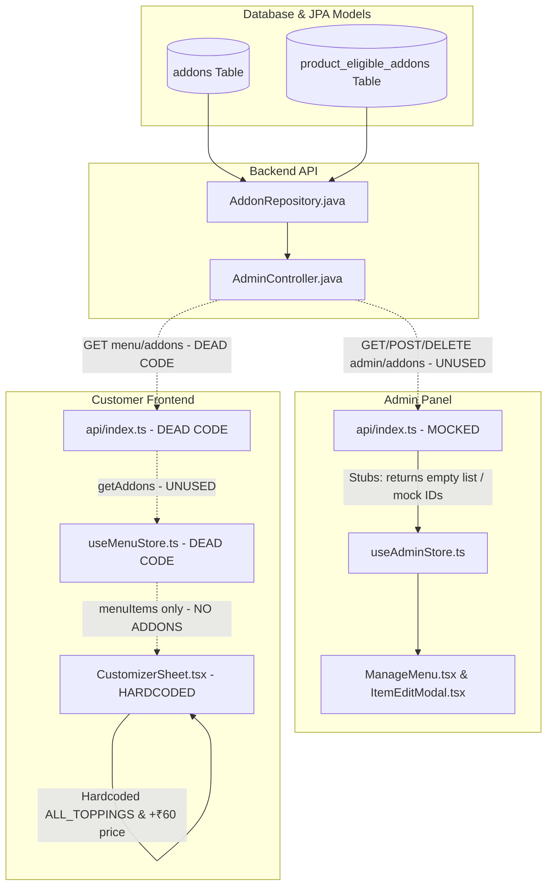

# Production Feature Audit: Dynamic Add-ons & Toppings System
**Prepared by**: Senior Full Stack Software Architect, QA Engineer, and System Analyst  
**Project**: QR-Based Order Management System  
**Status**: Analysis & Audit Only (No Code Modified/Implemented)  
**Date**: July 7, 2026

---

## Executive Summary
This audit provides a deep architectural and functional analysis of the **Dynamic Add-ons (Toppings) System** in the QR-Based Order Management application. 

The core finding of this audit is that **the Add-ons/Toppings system is NOT fully dynamic**. There is a severe and critical disconnect between the Database/Backend layer, the Admin Panel, and the Customer-Facing Frontend. While the backend defines JpaRepositories and controllers for managing Add-ons, the Admin Panel relies on mocked static stubs that fail to interact with the backend, and the Customer Frontend uses entirely hardcoded lists, pricing, and customization options.

Consequently, **the system is not production-ready**. Any changes made in the Admin Panel to add-ons will have zero impact on what customers see or are charged.

---

## 1. Current Architecture
The system consists of three primary components:
1. **Backend (Java / Spring Boot / PostgreSQL)**: Uses Hibernate for DDL generation and JPA for data access. Exposes endpoints for managing simple flat `Addon` entities under `/api/admin/addons`.
2. **Admin Panel (React / TypeScript / Vite / Zustand)**: A dashboard under the `qr-admin` folder where admins manage menu items, categories, settings, and addons.
3. **Customer Frontend (React / TypeScript / Vite / Zustand)**: The mobile-responsive interface under the `frontend` folder where customers browse the menu, customize drinks, and place orders.

### The Architectural Disconnect


---

## 2. Phase-by-Phase Audit Findings

### Phase 1 — Admin Analysis

#### Add-on Categories
* **Status**: **Not Implemented**
* **Details**: 
  * The Admin **cannot** create category groupings such as "Milk Options", "Cheese Options", "Sugar Level", or "Extra Toppings".
  * There is **no database model** for Add-on Categories. There is only a `Category` entity which represents menu/product categories (e.g. "Milk Teas - Classics").
  * No DTOs, controllers, frontend stores, or inputs exist for grouping addons. Addons are managed as a single global flat library.

#### Add-on Items
* **Status**: **Partially Implemented (Mocked on Frontend)**
* **Details**:
  * **Database Entity**: Represented in [Addon.java](file:///c:/Users/KRISH/OneDrive/Desktop/QR%20Based%20Order%20Management/backend/src/main/java/com/popobob/model/Addon.java) with `id` (String), `name` (String), `price` (BigDecimal), and `isActive` (Boolean).
  * **Repository**: Exists as [AddonRepository.java](file:///c:/Users/KRISH/OneDrive/Desktop/QR%20Based%20Order%20Management/backend/src/main/java/com/popobob/repository/AddonRepository.java) extending `JpaRepository<Addon, String>`.
  * **Controller**: Endpoints are defined in [AdminController.java](file:///c:/Users/KRISH/OneDrive/Desktop/QR%20Based%20Order%20Management/backend/src/main/java/com/popobob/controller/AdminController.java) at `/api/admin/addons` (GET, POST, DELETE).
  * **Admin API & Store**: **CRITICAL BUG**. In the Admin API wrapper ([api/index.ts](file:///c:/Users/KRISH/OneDrive/Desktop/QR%20Based%20Order%20Management/qr-admin/src/api/index.ts#L63-L65)), the addon methods are mocked to local state:
    ```typescript
    export const getAddons = async () => [];
    export const createAddon = async (addon: any) => ({ ...addon, id: Date.now().toString() });
    export const deleteAddon = async (_id: string) => {};
    ```
    The admin store `useAdminStore.ts` manages addons using these stubs. Because `getAddons` returns a static empty array, **any addons created by the admin are lost on page reload** as they are never fetched from or saved permanently to the backend.
  * **Product Links**: The product edit modal ([ItemEditModal.tsx](file:///c:/Users/KRISH/OneDrive/Desktop/QR%20Based%20Order%20Management/qr-admin/src/components/admin/ItemEditModal.tsx#L244-L271)) displays checkboxes to link products to eligible addons in the library. This updates `eligibleAddons` in the product payload, but since the addon library is always empty on reload, no addons can be linked.

#### Pricing
* **Status**: **Partially Implemented (Ignored by Frontend)**
* **Details**:
  * The Admin Panel allows inputting a price (e.g. ₹40) for a topping.
  * **Negative Pricing**: The frontend input specifies `min="0"`, but there is **no validation** in the backend JPA entity or DTO. An attacker could bypass the frontend and submit a negative price via API.
  * **Zero-Price Toppings**: Supported (a price of `0` is allowed).
  * **Frontend Disconnect**: **CRITICAL BUG**. The customer frontend ignores the database price entirely. In [CustomizerSheet.tsx](file:///c:/Users/KRISH/OneDrive/Desktop/QR%20Based%20Order%20Management/frontend/src/components/CustomizerSheet.tsx#L50), the price addition is hardcoded to **`+₹60 each`** for all extra toppings:
    ```typescript
    totalPrice += (extraToppings.length * 60);
    ```

#### Availability
* **Status**: **Partially Implemented (Ignored by Frontend)**
* **Details**:
  * The `Addon` entity has an `isActive` boolean flag.
  * There is **no support** for Hidden, Soft Deleted, or Archived states.
  * Active/Inactive toggling is performed locally in the admin store, but is never persisted due to mocked API functions.

---

### Phase 2 — Backend Analysis

#### Endpoint Trace
* **Path**: Database Table `addons` $\rightarrow$ Entity `Addon.java` $\rightarrow$ Repository `AddonRepository.java` $\rightarrow$ Controller `AdminController.java` (`/api/admin/addons`).
* **Service Layer**: **Missing**. Unlike other features, there is no service class for Addons; the controller calls the repository directly.
* **DTO Layer**: **Missing**. The controller accepts raw entity objects, exposing the database structure directly.

#### Validation & Security
* **Validation**: **None**. The API controller lacks `@Valid` annotations or manual validation logic. An addon can be saved with empty names, negative prices, or malicious payloads.
* **Duplicate Protection**: None. Overwriting is possible by providing an existing ID.
* **Authentication**: Enforced via `SecurityConfig.java`. Requests to `/api/admin/**` require a valid JWT header with the `ADMIN` role.

#### Advanced Capabilities
* **Multiple Categories**: Not Supported.
* **Nested Toppings**: Not Supported.
* **Sorting / Ordering**: Not Supported. Addons are returned in whatever order the database retrieves them (`findAll()`).

---

### Phase 3 — Frontend Analysis

#### Customize Drink Flow
When a customer clicks the "Customize" button:
1. It opens [CustomizerSheet.tsx](file:///c:/Users/KRISH/OneDrive/Desktop/QR%20Based%20Order%20Management/frontend/src/components/CustomizerSheet.tsx).
2. The user is presented with choices: Size, Choice of Milk, Choice of Free Topping, and Choice of Extra Toppings.
3. The selections are stored in local component state (`size`, `milk`, `freeTopping`, `extraToppings`).
4. On clicking "Add to Cart", the selections are merged into a single flat string.

#### Dynamic vs Hardcoded Toppings
* **Status**: **Hardcoded**
* **Details**: The frontend completely ignores the backend addon endpoints. The list of toppings is defined as a static local array constant:
  ```typescript
  const ALL_TOPPINGS = [
    'Tapioca Pearls (Boba)', 'Popping Boba (Strawberry)', 'Popping Boba (Mango)', 
    'Lychee Boba', 'Blueberry Boba', 'Chocolate Boba', 'Brown Sugar Jelly', 
    'Mango Jelly', 'Coffee Foam', 'Cheese Foam', 'Whipped Cream'
  ];
  ```
  Every single beverage shows this exact same list. Even worse, **Quick Bites (like French Fries or Cheese Shots) display the exact same customizer sheet**, allowing customers to order French Fries with "Cheese Foam" and "Tapioca Pearls".

#### Selection Rules
* **Single vs Multi Select**:
  * **Size**: Single-select (Regular vs Large).
  * **Milk**: Single-select.
  * **Free Topping**: Single-select. **CRITICAL BUG**: This selection is marked as required (`*`). A customer **cannot** decline the free topping; they are forced to choose one to add the drink to the cart.
  * **Extra Toppings**: Multi-select, hardcoded at `+₹60 each`.
* **Min / Max Limits**: **Not Implemented**. There are no limits on the number of extra toppings a customer can select. A user can select all 11 toppings simultaneously.

---

### Phase 4 — Cart Analysis

#### Cart Data Structure
* **Status**: **Flat Customization String**
* **Details**: The shopping cart store ([useCartStore.ts](file:///c:/Users/KRISH/OneDrive/Desktop/QR%20Based%20Order%20Management/frontend/src/store/useCartStore.ts)) does **not** store toppings or addons as separate structured objects. Instead, they are collapsed into a single pipe-separated string during "Add to Cart":
  ```typescript
  let customizations = [];
  customizations.push(size);
  if (product.category === 'Milk Teas') customizations.push(milk);
  if (freeTopping) customizations.push(`Free: ${freeTopping}`);
  if (extraToppings.length > 0) customizations.push(`Extra: ${extraToppings.join(', ')}`);
  
  cartStore.addItem({
    product: product,
    customization: customizations.join(' | '),
    price: totalPrice,
    quantity: 1
  });
  ```
* **Saved Fields**:
  * **Category**: Not Saved (no topping category exists).
  * **Topping Name**: Stored only as raw text within the string.
  * **Price**: Not Saved (only the pre-computed item total is saved).
  * **Quantity**: Not Saved (toppings cannot have individual quantities).
  * **IDs**: Not Saved.
  * **Special Notes**: Not Saved.

---

### Phase 5 — Order Analysis

#### Order Payload
When placing an order ([Cart.tsx](file:///c:/Users/KRISH/OneDrive/Desktop/QR%20Based%20Order%20Management/frontend/src/pages/customer/Cart.tsx#L235-L252)), the payload structured as follows is sent to the backend `POST /api/orders`:
```json
{
  "customerName": "John Doe",
  "customerPhone": "9876543210",
  "tableNumber": "5",
  "storeId": 1,
  "orderType": "DINE_IN",
  "paymentReference": "PAY_AT_COUNTER",
  "paymentStatus": "PENDING",
  "items": [
    {
      "productId": "p-brown-sugar-boba",
      "productName": "Brown Sugar Boba",
      "price": 369.0,
      "quantity": 1,
      "subtotal": 369.0,
      "customizations": "Large | Soy Milk | Free: Tapioca Pearls (Boba) | Extra: Coffee Foam, Whipped Cream"
    }
  ]
}
```
* **Calculations**: Total amount, tax rate, packaging charge, and loyalty discounts are computed entirely on the client-side and submitted.
* **Backend Validation**: **CRITICAL SECURITY RISK**. The backend does **not** recalculate prices or validate subtotals against the database. It blindly saves whatever price and subtotal the client sends. An attacker could edit the javascript bundle to set the price of the customized drink to `₹1` and the backend would accept and record the order at that price.

---

### Phase 6 — Admin Order View

#### Kitchen Display System (KDS)
* **Status**: **Raw String Dump**
* **Details**: In [KDS.tsx](file:///c:/Users/KRISH/OneDrive/Desktop/QR%20Based%20Order%20Management/frontend/src/pages/admin/KDS.tsx#L73-L75), the selected toppings and milk options are rendered as a raw string dump:
  ```typescript
  {item.customizations && (
    <p className="text-[11px] text-gray-500 leading-tight bg-gray-50 p-1 rounded mt-0.5">{item.customizations}</p>
  )}
  ```
* **Limitations**:
  * No categorization.
  * No visual grouping.
  * Extra prices are not highlighted.
  * No separation of special instructions from toppings.

---

### Phase 7 — Invoice Analysis

#### Receipts and Invoices
* **Status**: **Not Implemented**
* **Details**: 
  * The customer tracking page ([OrderTracking.tsx](file:///c:/Users/KRISH/OneDrive/Desktop/QR%20Based%20Order%20Management/frontend/src/pages/customer/OrderTracking.tsx)) does **not** display any invoice, receipt, or billing breakdown. It only shows a progress timeline and redirects the customer to the AI Chatbot page after 2.5 seconds.
  * There is no downloadable PDF or invoice view containing the selected toppings, category names, extra prices, or final total.

---

## 3. Gap Analysis

### Missing Features
1. **Add-on Categories**: No database entity or backend support for categorizing add-ons (Milk Options, Sugar Level, etc.).
2. **Dynamic Frontend Syncing**: The customer frontend does not load the addon database.
3. **Topping Pricing Engine**: Individual topping pricing is ignored; instead, the price of ₹60 is hardcoded.
4. **Mandatory/Optional Configuration**: Missing rules to allow declining a topping (currently, 1 free topping is forced).
5. **Min/Max Selection Constraints**: No limits on the number of addons a user can select.
6. **Backend Price Recalculation**: The backend does not verify client-sent prices against the database.

### Architectural & Database Problems
* The backend entity `Addon` is too simplistic (flat).
* Lack of DTO validation in `AdminController.java` makes the endpoints vulnerable to invalid data.
* Using raw String IDs for addons instead of database-generated UUIDs or Auto-increment IDs creates collisions and update security risks.

---

## 4. Edge Cases Analysis

| Edge Case | Behaviour / Impact | Severity |
| :--- | :--- | :--- |
| **No toppings chosen** | **Blocked**. Customer is forced to select at least 1 free topping. Plain drinks cannot be ordered. | **High (Critical UX Bug)** |
| **100 toppings chosen** | Allowed. The UI will overflow and the flat string will grow excessively long. | **Medium** |
| **Price changed in cart** | The customer pays whatever price was calculated at the moment they added it to the cart. If the admin updates the price, the cart is unaffected. | **Low** |
| **Admin deletes topping** | Since the frontend uses a hardcoded array, deleting a topping in the Admin panel has **zero effect** on what the customer sees. | **Low** |
| **Duplicate names** | No database constraint. Admin can create multiple toppings named "Boba". | **Medium** |
| **API Failure** | Since the admin and client frontend do not load toppings from the API, an API failure will not affect the customizer sheet load, but order placement would fail. | **High** |

---

## 5. Production Readiness Score

| Criteria | Score (1-10) | Remarks |
| :--- | :--- | :--- |
| **Database Design** | **3 / 10** | Missing categories, relations, and auto-generated IDs. |
| **Backend Implementation** | **4 / 10** | Basic flat endpoints exist, but missing service layer, DTOs, and price validation. |
| **Frontend Implementation** | **1 / 10** | Completely hardcoded toppings list, mandatory rules, and addon prices. |
| **Admin Panel** | **2 / 10** | Addon management forms are mocked to local state and never persist. |
| **Security** | **2 / 10** | Backend does not validate client-submitted order subtotals (vulnerable to price tampering). |
| **Scalability** | **1 / 10** | Adding or changing a topping requires recompiling and redeploying the customer app. |
| **Maintainability** | **2 / 10** | Dead code and mocked functions are present in API files. |
| **Overall Score** | **2.1 / 10** | **NOT PRODUCTION READY** |

---

## 6. Recommendations & Action Plan (For Future Development)
To transition this feature from the current mock/hardcoded state to a fully dynamic, production-ready system:

1. **Database Schema Enhancements**:
   * Create an `AddonCategory` entity (representing "Milk Options", "Ice Level", "Toppings").
   * Link `Addon` to `AddonCategory` (Many-to-One).
   * Link `Product` to `AddonCategory` (Many-to-Many) instead of flat `eligibleAddons` arrays. This allows assigning entire option groups to specific products (e.g. only milk options to tea products, not fries).
2. **Backend API Overhaul**:
   * Implement `AddonCategoryController` and `AddonCategoryService`.
   * Create request/response DTOs with validation annotations (`@NotNull`, `@Min(0)`).
   * **Crucial**: Implement price validation in `OrderService.java` to recalculate subtotals on the server using database prices instead of trusting the client payload.
3. **Admin Panel Integration**:
   * Connect `useAdminStore.ts` to the backend `/api/admin/addons` and `/api/admin/addon-categories` endpoints by replacing the mock stubs.
4. **Frontend Dynamic Rendering**:
   * Replace the hardcoded `ALL_TOPPINGS` array with a dynamic call fetching categories and eligible toppings linked to the product.
   * Render customizer components dynamically based on categories (e.g., radio buttons for single-select categories, checkboxes for multi-select, select inputs for optional ones).
   * Read prices dynamically from the addon object instead of hardcoding `+₹60`.
