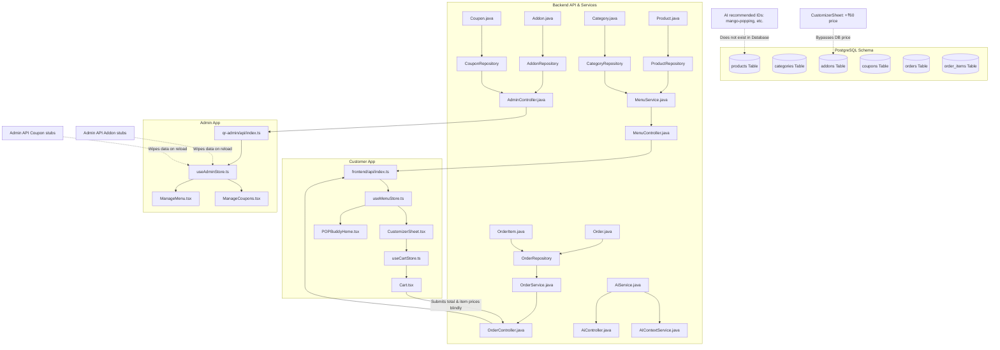

# Production Migration Master Blueprint: Hybrid to Fully Dynamic QR Ordering System
**Document Version**: 1.0.0  
**Prepared by**: Chief Software Architect, Technical Lead, and Production Migration Specialist  
**Status**: Architecture & Migration Planning Freeze (No Code Modified)  
**Date**: July 7, 2026

---

## 1. Current System Architecture

The project is currently in a **hybrid operational state**. The core ordering loop (dine-in, pickup, payments, KDS status tracking) is wired to a live PostgreSQL database and Spring Boot backend. However, features such as addons/customizers, coupon codes, and AI-recommended actions are running on mock data, hardcoded client-side constants, or static backend stubs.

```
       [ CUSTOMER FRONTEND (React) ]              [ ADMIN FRONTEND (React) ]
             (Zustand Stores)                           (Zustand Stores)
         useMenuStore | useCartStore               useAdminStore | useAuthStore
                     │                                         │
                     ▼                                         ▼
           Customer API Wrapper                      Admin API Wrapper
                     │                                         │
                     └───────────────────┬─────────────────────┘
                                         │  (HTTP / WebSocket)
                                         ▼
                            [ BACKEND SPRING BOOT API ]
                               (Spring Security / JWT)
                                         │
                                         ▼
                               [ JPA REPOSITORIES ]
                                         │
                                         ▼
                            [ POSTGRESQL DATABASE ]
```

---

## 2. Dependency Graph (Phase 1)

This graph displays the operational and data dependencies of the system, highlighting critical paths, circular risks, and hidden mismatches.



### Key Architectural Vulnerabilities:
1. **Critical Dependency (Checkout)**: The checkout payload generated by `Cart.tsx` dictates the price of item subtotals. `OrderService.java` performs no server-side price validation against `products` or `addons` tables, exposing the platform to client-side price tampering.
2. **Hidden ID Mismatch**: `AIContextService.java` returns hardcoded recommendation product IDs (e.g. `mango-popping`, `matcha-latte`). These do not exist in the seeded menu table (which has IDs like `p-mango-milk-tea`). This causes product card rendering in `POPBuddyHome.tsx` to return `null` and fail silently.
3. **Circular Configuration**: Admin Panel and Customer App use separate configuration files and API managers. Toggling category availability in `useAdminStore.ts` does not propagate to the database, leaving it desynced.

---

## 3. Production Readiness Matrix (Phase 2)

| Feature | Database | Backend | Admin Panel | Customer Frontend | Status | Code Evidence / Missing Components |
| :--- | :--- | :--- | :--- | :--- | :--- | :--- |
| **Authentication** | Fully | Fully | Fully | Fully | **Fully Implemented** | Uses [SecurityConfig.java](file:///C:/Users/KRISH/OneDrive/Desktop/QR%20Based%20Order%20Management/backend/src/main/java/com/popobob/config/SecurityConfig.java) JWT filter. |
| **Products** | Fully | Fully | Fully | Fully | **Fully Implemented** | [Product.java](file:///C:/Users/KRISH/OneDrive/Desktop/QR%20Based%20Order%20Management/backend/src/main/java/com/popobob/model/Product.java) entity and REST CRUD fully integrated. |
| **Categories** | Fully | Fully | Fully | Fully | **Fully Implemented** | Exposes categories dynamically. |
| **Product Images** | Fully | Fully | Fully | Fully | **Fully Implemented** | Backed by Cloudinary upload services in admin. |
| **Add-ons** | Fully | Fully | Mocked | Mocked | **Mocked** | Admin API uses [stub stubs](file:///C:/Users/KRISH/OneDrive/Desktop/QR%20Based%20Order%20Management/qr-admin/src/api/index.ts#L63-L65); Customer app hardcodes `ALL_TOPPINGS` list and `+₹60` price. |
| **Add-on Categories**| Missing | Missing | Missing | Missing | **Missing** | No database tables, entities, DTOs, or customizer groups exist. |
| **Customization** | Partially | Partially | Partially | Mocked | **Partially Implemented**| Eligible addons list maps in backend, but customizer UI is hardcoded. |
| **Cart** | None | None | None | Fully | **Local State Only** | Uses Zustand local storage persist. No session syncing. |
| **Checkout** | Fully | Fully | None | Fully | **Fully Implemented** | Integrates with Razorpay checkout payload. |
| **Orders** | Fully | Fully | Fully | Fully | **Fully Implemented** | [OrderService.java](file:///C:/Users/KRISH/OneDrive/Desktop/QR%20Based%20Order%20Management/backend/src/main/java/com/popobob/service/OrderService.java) manages checkout. |
| **Kitchen Display** | None | Fully | None | Fully | **Fully Implemented** | Real-time WebSocket updates via [KDS.tsx](file:///C:/Users/KRISH/OneDrive/Desktop/QR%20Based%20Order%20Management/frontend/src/pages/admin/KDS.tsx). |
| **Coupons** | Fully | Fully | Mocked | Mocked | **Mocked** | Admin stubs coupons to `[]`; frontend has dummy visual block. |
| **QR Generator** | None | None | Fully | None | **Fully Implemented** | Local QR generation using canvas works. |
| **Discovery/CMS** | Fully | Fully | Fully | Fully | **Fully Implemented** | Syncs campaigns, stories, and sections. |
| **AI (POP Buddy)** | Mocked | Mocked | Fully | Mocked | **Mocked** | [AIContextService.java](file:///C:/Users/KRISH/OneDrive/Desktop/QR%20Based%20Order%20Management/backend/src/main/java/com/popobob/ai/service/AIContextService.java) serves raw mocked objects. |
| **Loyalty** | Fully | Fully | None | Fully | **Fully Implemented** | Points computed dynamically in [OrderService.java](file:///C:/Users/KRISH/OneDrive/Desktop/QR%20Based%20Order%20Management/backend/src/main/java/com/popobob/service/OrderService.java#L96). |
| **Analytics** | None | None | None | None | **Missing** | No analytics backend database or tracking charts exist. |
| **Store Settings** | Fully | Fully | Fully | Fully | **Fully Implemented** | Controls operational params dynamically. |

---

## 4. Database Migration Plan (Phase 4)

We assume the target database is running in production with live customer and product data. No tables can be dropped or cleared.

### 4.1 Schema Changes (Target Schema DDL)

To implement dynamic toppings and coupons, we will introduce:
1. **`addon_categories` Table**: Groupings for toppings (e.g. Milk Choice, Sweetness).
2. **`product_addon_categories` Join Table**: Link products to option groups.
3. **`order_item_addons` Join Table**: Structured order record for selected toppings.

```sql
-- Liquibase / Flyway Migration Script

-- 1. Create addon_categories table
CREATE TABLE addon_categories (
    id VARCHAR(50) PRIMARY KEY,
    name VARCHAR(100) NOT NULL,
    min_selections INT DEFAULT 0,
    max_selections INT DEFAULT 1,
    is_required BOOLEAN DEFAULT FALSE,
    display_order INT DEFAULT 0
);

-- 2. Link addon to addon_categories
ALTER TABLE addons ADD COLUMN category_id VARCHAR(50);
ALTER TABLE addons ADD CONSTRAINT fk_addon_category FOREIGN KEY (category_id) REFERENCES addon_categories(id);

-- 3. Create product_addon_categories join table
CREATE TABLE product_addon_categories (
    product_id VARCHAR(50) NOT NULL,
    category_id VARCHAR(50) NOT NULL,
    PRIMARY KEY (product_id, category_id),
    CONSTRAINT fk_product FOREIGN KEY (product_id) REFERENCES products(id),
    CONSTRAINT fk_category FOREIGN KEY (category_id) REFERENCES addon_categories(id)
);

-- 4. Create structured order_item_addons join table (Deprecating flat customizations column)
CREATE TABLE order_item_addons (
    order_item_id UUID NOT NULL,
    addon_id VARCHAR(50) NOT NULL,
    addon_name VARCHAR(100) NOT NULL,
    addon_price DECIMAL(10, 2) NOT NULL,
    PRIMARY KEY (order_item_id, addon_id),
    CONSTRAINT fk_order_item FOREIGN KEY (order_item_id) REFERENCES order_items(id),
    CONSTRAINT fk_addon FOREIGN KEY (addon_id) REFERENCES addons(id)
);

-- 5. Add max_discount constraint to coupons
ALTER TABLE coupons ADD COLUMN max_discount DECIMAL(10, 2);
```

### 4.2 Data Conversion & Backward Compatibility
* **Product Catalog Compatibility**: Legacy products will retain their fields. If a product does not have any entries in `product_addon_categories`, the Customizer UI will fallback to rendering no options (plain add-to-cart).
* **Order History Compatibility**: The existing `customizations` flat text column in `order_items` must not be dropped. Older orders will continue to render this column, while newer orders will populate `order_item_addons` to calculate structured statistics.
* **Rollback Script**:
  ```sql
  DROP TABLE IF EXISTS order_item_addons;
  DROP TABLE IF EXISTS product_addon_categories;
  ALTER TABLE addons DROP COLUMN IF EXISTS category_id;
  DROP TABLE IF EXISTS addon_categories;
  ALTER TABLE coupons DROP COLUMN IF EXISTS max_discount;
  ```

---

## 5. API Migration Strategy (Phase 5)

We will introduce a **Versioned URI Path** (`/api/v2/`) to handle breaking changes safely. Legacy endpoints will remain active for active customer sessions during deployment.

### v2 Endpoints Overview
| Endpoint | Method | Payload | Auth | Purpose |
| :--- | :--- | :--- | :--- | :--- |
| `/api/v2/admin/addons` | POST | `AddonDto` | Admin JWT | Create/Update Addon |
| `/api/v2/admin/addon-categories`| POST | `AddonCategoryDto` | Admin JWT | Create Addon Group |
| `/api/v2/menu/products/{id}/customizer`| GET | None | Public | Get category options for product |
| `/api/v2/public/coupons/validate`| POST | `{ "code": "SUMMER", "amount": 250 }`| Public | Validate coupon & return discount |
| `/api/v2/orders` | POST | `OrderRequestDtoV2` | Public | Submit order with structured toppings |

### Validation Improvements (DTO Example)
```java
package com.popobob.dto;

import jakarta.validation.constraints.*;
import java.math.BigDecimal;
import java.util.List;

public class OrderRequestDtoV2 {
    @NotBlank
    private String customerName;
    @Pattern(regexp = "^[0-9]{10}$")
    private String customerPhone;
    
    private String tableNumber;
    private String paymentReference;
    
    @NotEmpty
    private List<OrderItemDtoV2> items;
}
```

---

## 6. Frontend Migration Strategy (Phase 6)

To prevent screen freezes and JS runtime exceptions, the customer app will migrate components in a **decoupled** manner using feature flags.

1. **Independent Migrations**:
   * **Admin Dashboard Charts**: Can be migrated directly since it does not block the menu, cart, or order flows.
   * **Admin Profile settings / QR code layouts**: Fully isolated.
2. **Coupled Migrations (Atomic Release)**:
   * The **Customizer UI** (`CustomizerSheet.tsx`), the **Cart Store** (`useCartStore.ts`), and the **Backend Order Service** (`OrderService.java`) **MUST migrate together**. If the frontend sends structured JSON objects for toppings but the backend expects the flat string format (or vice versa), orders will fail immediately.
3. **Crash Prevention Hook (Zustand Schema Migration)**:
   ```typescript
   // Migration key inside useCartStore.ts partializer
   migrate: (persistedState: any, version: number) => {
     if (version === 0) {
       // Legacy cart item customization translation
       return {
         ...persistedState,
         items: persistedState.items.map((item: any) => ({
           ...item,
           structuredToppings: [] // Initialize blank structured array for legacy localStore carts
         }))
       };
     }
     return persistedState;
   }
   ```

---

## 7. Risk Assessment (Phase 7)

| Migration Step | Risk Level | Potential Impact | Detection Mechanism | Recovery Plan |
| :--- | :---: | :--- | :--- | :--- |
| **Order Toppings Schema Release** | **Critical** | Customer orders fail during payload submission (HTTP 400/500). | Monitor Spring Boot log errors and watch for spikes in transaction drops. | Revert database schema to prior states and toggle `USE_DYNAMIC_ADDONS=false`. |
| **Razorpay Total Mismatch** | **Critical** | Customer pays but checkout verification fails in order service. | Compare dashboard revenue reports with payment logs. | Alert support staff to override KDS order status manually. |
| **Coupon Billing Deductions** | **High** | Customers receive unauthorized discounts or negative billing amounts. | Check coupon validation requests and order totals in DB. | Deactivate all coupons in database or toggle `USE_DYNAMIC_COUPONS=false`. |
| **AI ID Mismatch** | **Medium** | Recommender cards appear blank, causing drop in up-selling items. | Monitor client console errors for card rendering failures. | Rollback AI context endpoint to static `FALLBACK_DATA`. |

---

## 8. Feature Flag Strategy (Phase 8)

We will use environment variables inside `application.yml` (Backend) and `.env` (Frontend) to isolate new logic.

* **`VITE_USE_DYNAMIC_ADDONS`**:
  * *True*: Fetches options and category configurations from `/api/v2/menu/products/{id}/customizer`.
  * *False*: Falls back to hardcoded `ALL_TOPPINGS` list and `+₹60` pricing.
* **`VITE_USE_DYNAMIC_COUPONS`**:
  * *True*: Renders active coupon codes, coupon inputs in the checkout cart, and queries the validation API.
  * *False*: Restores static "Apply Coupon" display.
* **`VITE_USE_DYNAMIC_AI`**:
  * *True*: Connects AI context endpoints to search DB products directly.
  * *False*: Serves static mock context variables.
* **`SPRING_SECURITY_DISABLE_PRICE_TAMPERING`**:
  * *True*: Enforces server-side recalculation of totals before orders are saved.
  * *False*: Accepts pricing totals from frontend client.

---

## 9. Regression Testing Strategy (Phase 9)

### 9.1 Cart & Checkout Checklist
* [ ] Add a beverage to cart, select 0 toppings (verify option is available and does not crash checkout).
* [ ] Select 5 toppings (verify that extra prices are computed correctly: `Base + (qty * database price)`).
* [ ] Enter a valid coupon code (verify discount deducts from subtotal).
* [ ] Enter an invalid coupon code (verify alert error shows up and subtotal is unchanged).
* [ ] Bypass frontend checkout and submit a POST request to `/api/orders` with a edited low price (verify the backend catches the manipulation and returns `400 Bad Request`).

### 9.2 Operations & Display Checklist
* [ ] Place a dynamic customized order (verify that it transmits via WebSocket and shows on the KDS panel).
* [ ] Verify that KDS displays toppings separated by category groups.
* [ ] Change an addon price in the Admin panel (verify that new orders reflect the updated price immediately).
* [ ] Toggle an addon inactive in the Admin panel (verify it immediately disappears from the customer Customizer UI).

---

## 10. Master Migration Roadmap (Phase 10)

```
[Phase 0: Architecture Freeze]
       │
       ▼
[Phase 1: DB Schema Migration (Flyway/Liquibase)]
       │
       ▼
[Phase 2: Backend REST v2 API Endpoints]
       │
       ▼
[Phase 3: Server-side Billing Validation & Unit Testing]
       │
       ▼
[Phase 4: Admin Panel API Integration (Flags On)]
       │
       ▼
[Phase 5: Customer Store Integration & Customizer UI Refactoring]
       │
       ▼
[Phase 6: Coupon Checkout Logic Integration]
       │
       ▼
[Phase 7: AI Buddy ID Mapping & Search Engine Connection]
       │
       ▼
[Phase 8: Operations QA & End-to-End Simulation]
       │
       ▼
[Phase 9: Production Blue-Green Deployment]
```

* **Production QA Criteria**: Zero order payload failures over 100 consecutive automated test ordering flows.
* **Post-Deployment Validation**: Verify that the KDS, payment gateways, and backend database record identical total amounts.
