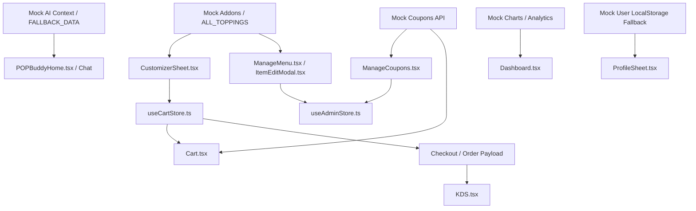

# Production Feature Audit: Mock Data Dependency & Migration Impact Assessment
**Prepared by**: Senior Full Stack Software Architect, QA Engineer, and System Analyst  
**Project**: QR-Based Order Management System  
**Status**: Analysis & Audit Only (No Code Modified/Implemented)  
**Date**: July 7, 2026

---

## Executive Summary
This assessment maps all mock data usage, hardcoded values, local placeholders, and empty API implementations in the QR-Based Order Management system. Replacing these mocks with live backend data presents varying levels of risk to the application. This report outlines those dependencies, identifies gap mismatches, evaluates risks, and delivers a safe, phased migration strategy.

---

## 1. Mock Data Inventory (Phase 1)
Below is the complete inventory of all mock data, static constants, stubs, and placeholder features discovered across the project:

### 1.1 Add-ons & Toppings
* **Admin API Stub**: In [api/index.ts (Admin)](file:///C:/Users/KRISH/OneDrive/Desktop/QR%20Based%20Order%20Management/qr-admin/src/api/index.ts#L63-L65), `getAddons` returns a static empty array `[]`. `createAddon` returns the posted addon with a fake ID (`Date.now().toString()`), and `deleteAddon` is a blank function.
* **Customer API Dead End**: In [api/index.ts (Customer)](file:///C:/Users/KRISH/OneDrive/Desktop/QR%20Based%20Order%20Management/frontend/src/api/index.ts#L12), `getAddons` fetches `/menu/addons` but is never imported or called by the store or components.
* **Customer Local Array**: In [CustomizerSheet.tsx](file:///C:/Users/KRISH/OneDrive/Desktop/QR%20Based%20Order%20Management/frontend/src/components/CustomizerSheet.tsx#L9-L14), options like `MILK_OPTIONS` and `ALL_TOPPINGS` are defined as local static arrays.
* **Hardcoded Toppings Pricing**: In [CustomizerSheet.tsx](file:///C:/Users/KRISH/OneDrive/Desktop/QR%20Based%20Order%20Management/frontend/src/components/CustomizerSheet.tsx#L50), extra toppings are hardcoded to `+₹60 each`.

### 1.2 Coupons & Promo Codes
* **Customer API Stub**: In [api/index.ts (Customer)](file:///C:/Users/KRISH/OneDrive/Desktop/QR%20Based%20Order%20Management/frontend/src/api/index.ts#L11), `getCoupons` returns a static empty array `[]`.
* **Admin API Stub**: In [api/index.ts (Admin)](file:///C:/Users/KRISH/OneDrive/Desktop/QR%20Based%20Order%20Management/qr-admin/src/api/index.ts#L59-L61), `getCoupons` returns `[]`. `createCoupon` creates a mock object with `Date.now()`, and `deleteCoupon` is a blank function.
* **Zustand Stubs**: Both stores initialize `coupons: []` and perform operations locally without database persistence.

### 1.3 AI Engagement Layer (POP Buddy & AI Context)
* **Backend Mock Service**: In [AIContextService.java](file:///C:/Users/KRISH/OneDrive/Desktop/QR%20Based%20Order%20Management/backend/src/main/java/com/popobob/ai/service/AIContextService.java#L30-L89), `getMockedContext` returns mocked objects for customer info, wallet points, active orders, recommendations, trending products, missions, rewards, and fun facts.
* **Customer Frontend Fallback**: In [useAIContext.ts](file:///C:/Users/KRISH/OneDrive/Desktop/QR%20Based%20Order%20Management/frontend/src/pages/customer/ai/hooks/useAIContext.ts#L75-L124), `FALLBACK_DATA` contains a duplicate frontend copy of the mocked context data. This acts as a silent fallback if the backend API `/api/ai/context` returns an error (e.g. 503).
* **Zustand AI Settings**: In [AISettings.tsx](file:///C:/Users/KRISH/OneDrive/Desktop/QR%20Based%20Order%20Management/qr-admin/src/pages/admin/AISettings.tsx), the AI system prompts are loaded and saved, but the active context relies entirely on the mock service.

### 1.4 User Profile Mocks
* **Local User Fallback**: In [api/index.ts (Customer)](file:///C:/Users/KRISH/OneDrive/Desktop/QR%20Based%20Order%20Management/frontend/src/api/index.ts#L43-L55), if the server fails to return a profile, `getUserProfile` reads `mock_user_` keys from localStorage.

### 1.5 Category Active Status
* **Inert State**: In [useAdminStore.ts](file:///C:/Users/KRISH/OneDrive/Desktop/QR%20Based%20Order%20Management/qr-admin/src/store/useAdminStore.ts#L382-L387), `toggleCategoryActive` flips category active status locally in the store but calls no API. Categories cannot be disabled in the database.

### 1.6 Dashboard Analytics
* **Chart Placeholders**: In [Dashboard.tsx](file:///C:/Users/KRISH/OneDrive/Desktop/QR%20Based%20Order%20Management/qr-admin/src/pages/admin/Dashboard.tsx#L130-L150), charts for "Revenue Performance" and "Popular Menu Items" are static, inert visual placeholders.

---

## 2. Dependency Mapping (Phase 2)



### Dependency Map Table
| Mock Implementation | Consumers | Zustand Store | Backend Endpoint expected |
| :--- | :--- | :--- | :--- |
| **`ALL_TOPPINGS` & Toppings Price** | [CustomizerSheet.tsx](file:///C:/Users/KRISH/OneDrive/Desktop/QR%20Based%20Order%20Management/frontend/src/components/CustomizerSheet.tsx) | [useCartStore.ts](file:///C:/Users/KRISH/OneDrive/Desktop/QR%20Based%20Order%20Management/frontend/src/store/useCartStore.ts) | `GET /api/menu/addons` |
| **Admin Addon CRUD Stubs** | [ManageMenu.tsx](file:///C:/Users/KRISH/OneDrive/Desktop/QR%20Based%20Order%20Management/qr-admin/src/pages/admin/ManageMenu.tsx) & [ItemEditModal.tsx](file:///C:/Users/KRISH/OneDrive/Desktop/QR%20Based%20Order%20Management/qr-admin/src/components/admin/ItemEditModal.tsx) | [useAdminStore.ts](file:///C:/Users/KRISH/OneDrive/Desktop/QR%20Based%20Order%20Management/qr-admin/src/store/useAdminStore.ts) | `GET/POST/DELETE /api/admin/addons` |
| **Coupons CRUD Stubs** | [ManageCoupons.tsx](file:///C:/Users/KRISH/OneDrive/Desktop/QR%20Based%20Order%20Management/qr-admin/src/pages/admin/ManageCoupons.tsx) | [useAdminStore.ts](file:///C:/Users/KRISH/OneDrive/Desktop/QR%20Based%20Order%20Management/qr-admin/src/store/useAdminStore.ts) | `GET/POST/DELETE /api/admin/coupons` |
| **`FALLBACK_DATA` (AI)** | [POPBuddyHome.tsx](file:///C:/Users/KRISH/OneDrive/Desktop/QR%20Based%20Order%20Management/frontend/src/pages/customer/ai/POPBuddyHome.tsx) & [AIChatScreen.tsx](file:///C:/Users/KRISH/OneDrive/Desktop/QR%20Based%20Order%20Management/frontend/src/pages/customer/chat/AIChatScreen.tsx) | None | `GET /api/ai/context` |
| **`getMockedContext` (AI)** | [AiController.java](file:///C:/Users/KRISH/OneDrive/Desktop/QR%20Based%20Order%20Management/backend/src/main/java/com/popobob/controller/AiController.java) | None | Gemini AI / User and Order Repositories |
| **`mock_user_` Fallback** | [ProfileSheet.tsx](file:///C:/Users/KRISH/OneDrive/Desktop/QR%20Based%20Order%20Management/frontend/src/components/ui/ProfileSheet.tsx) | [useAuthStore.ts](file:///C:/Users/KRISH/OneDrive/Desktop/QR%20Based%20Order%20Management/frontend/src/store/useAuthStore.ts) | `GET /api/users/{id}` |
| **Dashboard Charts** | [Dashboard.tsx](file:///C:/Users/KRISH/OneDrive/Desktop/QR%20Based%20Order%20Management/qr-admin/src/pages/admin/Dashboard.tsx) | None | `GET /api/orders/history` aggregated analytics |

---

## 3. Migration Risk Analysis (Phase 3)

| Feature | Risk Level | Impact Scope | Explanation |
| :--- | :---: | :--- | :--- |
| **Add-ons & Toppings** | **CRITICAL** | Customer App, Checkout, Orders, KDS, Admin | If the frontend switches to dynamic API data without backend validation, attackers can manipulate the payment amount. Switching to live data without categories will load a giant flat list of toppings. |
| **Coupons** | **HIGH** | Cart, Checkout, Billing Calculations | Currently, there is zero logic in the frontend to validate coupon codes, deduct discounts from subtotals, or verify limits. Connecting coupons directly will break checkout calculations or allow arbitrary discounts. |
| **AI Engagement Layer** | **MEDIUM** | POP Buddy, Recommendations | **ID Mismatch Alert**: The AI mocks reference IDs like `mango-popping` and `matcha-latte` which do not exist in the database menu. Swapping the mock data without syncing these IDs will result in empty recommended cards. |
| **Category Availability**| **LOW** | Admin, Main Menu | Disabling a category on the admin side only affects local state. Storing this state in the database will require updating category structures. |
| **Dashboard Charts** | **LOW** | Admin Dashboard | Visual charts are currently blank placeholders. Implementing them requires adding a chart library (e.g., Chart.js or Recharts). |

---

## 4. API Gap Analysis (Phase 4)

Comparing the models shows several mismatches between the frontend expectations and backend structures:

```
[FRONTEND MODELS]                [BACKEND DATABASE / ENTITY]
-----------------                ---------------------------
Category:                        Category:
 - id (string)                    - id (string)
 - name (string)                  - name (string)
 - icon (string) <------------->  - description (string)
                                  - subcategories (list of strings)
                                  * MISMATCH: No icon column exists.

Coupon:                          Coupon:
 - id (string)                    - id (string)
 - code (string)                  - code (string)
 - type ('PERCENTAGE'|'FLAT')     - type (string)
 - discountValue (number)         - discountValue (number)
 - minOrderAmount (number)        - minOrderAmount (number)
 - maxDiscount (number) <------>  * MISMATCH: Backend lacks maxDiscount column.
 - active (boolean)               - active (boolean)

Addon:                           Addon:
 - id (string)                    - id (string)
 - name (string)                  - name (string)
 - price (number)                 - price (BigDecimal)
                                  - isActive (Boolean)
                                  * MISMATCH: Addon Categories are completely missing.
```

---

## 5. Store Analysis (Phase 5)

### Store State Inventory
1. **`useMenuStore.ts` (Customer App)**:
   * **Backend**: `menuItems`, `categories`, `campaigns`, `stories`, `discoverySections`.
   * **Mock**: `coupons: []` (always empty because `getCoupons` API returns `[]`).
   * **Impact on Removal**: Removing the mock will keep `coupons` empty but will not crash the UI since the coupon application feature is inactive anyway.
2. **`useCartStore.ts` (Customer App)**:
   * **Hybrid**: `items` (holds live products, but contains flat mock customizations strings).
   * **Local State**: `tableNumber`, `customerName`, `customerPhone`, `orderType`, `storeId`.
   * **Impact on Removal**: Safe; it does not directly contain mock constants.
3. **`useAdminStore.ts` (Admin Panel)**:
   * **Backend**: `menuItems`, `categories`, `campaigns`, `stories`, `discoverySections`, `storeSettings`.
   * **Mock**: `addons` (starts at `[]`, additions are local and temporary), `coupons` (starts at `[]`, additions are local and temporary).
   * **Impact on Removal**: Admin screens for Toppings and Coupons will immediately show blank tables.

---

## 6. Phased Migration Strategy (Phase 6)

### Phase 1: Database & Backend Upgrades
1. **Category Icon Mapping**: Add `icon` mapping to the Category model or keep a frontend icon lookup map.
2. **Addon Categories**: Create `AddonCategory` entity and link it to products.
3. **Price Validation**: Update `OrderService.java` to verify and recalculate all item subtotals and topping prices against the database.
4. **Coupon Calculations**: Write verification endpoints `/api/coupons/validate?code=X&amount=Y` in the backend.

### Phase 2: Admin Panel Integration
1. Replace mock functions in `qr-admin/src/api/index.ts` with real `adminApi` calls.
2. Fetch addons and coupons inside `initializeStore` in `useAdminStore.ts`.
3. Update `ItemEditModal.tsx` to handle category groupings for toppings.

### Phase 3: Customer Frontend Migration
1. Fetch coupons and addons from backend APIs in `useMenuStore.ts`.
2. Connect [CustomizerSheet.tsx](file:///C:/Users/KRISH/OneDrive/Desktop/QR%20Based%20Order Management/frontend/src/components/CustomizerSheet.tsx) to dynamic toppings groups.
3. Add a coupon input and validation call in [Cart.tsx](file:///C:/Users/KRISH/OneDrive/Desktop/QR%20Based%20Order%20Management/frontend/src/pages/customer/Cart.tsx).
4. Map AI recommended product IDs to database product keys.

### Rollback & Validation Plan
* **Rollback Strategy**: If a migration fails, keep mock fallbacks (like `FALLBACK_DATA` in the AI layer) and toggle them via a feature flag (`VITE_USE_MOCK_DATA=true`).
* **Regression Risks**: Payment calculations could break checkout if Razorpay receives mismatched totals. Always validate amounts on the backend before creating Razorpay orders.

---

## 7. Hidden Dependencies (Phase 7)
* **Hardcoded Topping Price**: The `+₹60` topping price addition in `CustomizerSheet.tsx` bypasses the database. If modified, the KDS string format must also be updated.
* **AI Recommended IDs**: Hardcoded IDs in `AIContextService.java` (`matcha-latte`, `mango-popping`) fail to match database products (`p-matcha-green-tea`, `p-mango-milk-tea`), causing silent rendering failures (recommended cards return `null`).
* **Guest User Wallet**: Guest users are initialized with `points: 0` in the AI context. If this changes, it might lead guests to believe they can redeem club points.

---

## 8. Production Impact of Immediate Mock Removal (Phase 8)

If all mock data is removed tomorrow without backend preparation:
1. **Immediate Failures**:
   * Admin screens for Toppings and Coupons will crash or render completely blank.
   * Customer checkout will fail if they choose extra toppings because the backend receives total amounts that do not match the database calculations.
2. **Silent Failures**:
   * AI Buddy will show no recommendations or mission reward cards.
   * The "Apply Coupon" button will remain clickable but do nothing.
3. **Data Corruption / Wrong Orders**:
   * Orders will be sent to the KDS with missing topping details if the flat customizations text string is removed before implementing structured order relations.

---

## 9. Final Migration Recommendations (Phase 9)

### 9.1 Risk Matrix
| Feature | Risk | Impact | Priority | Recommended Action |
| :--- | :---: | :---: | :---: | :--- |
| **Add-on System** | **Critical** | High | **1** | 🟡 Needs preparation (Build DB relations first) |
| **Coupon Validation** | **High** | Medium | **2** | 🟡 Needs preparation (Write validation APIs first) |
| **AI Recommendations** | **Medium** | Low | **3** | ✅ Safe to migrate now (Update product ID mapping) |
| **Dashboard Charts** | **Low** | Low | **4** | ✅ Safe to migrate now (Add chart library UI) |
| **Admin Profile Tab**| **Low** | Low | **5** | ✅ Safe to migrate now (Add a simple profile view) |

### 9.2 Migration Order Recommendation
```
[1. Backend DTO & DB Changes] ➔ [2. Backend Price Validation] ➔ [3. Admin API Integration] ➔ [4. Frontend Topping Sync] ➔ [5. Coupon Checkout Logic] ➔ [6. AI Recommender Sync]
```
